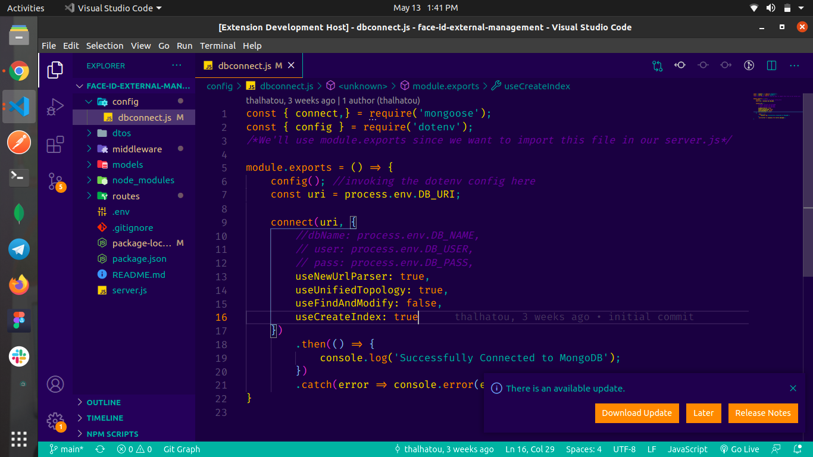

# seven dev Theme for VS Code

Thanks for checking out my VS Code theme. 

## Installation

1. Open the extensions sidebar on Visual Studio Code
1. Search for seven dev Theme
1. Click Install
1. Click Reload to reload your editor
1. 🌟🌟🌟🌟🌟 Rate five-stars 😃

## Issues & Suggestions

For any issues or suggestions, please use [GitHub issues](https://github.com/codestackr/codestackr-vscode-theme/issues).
