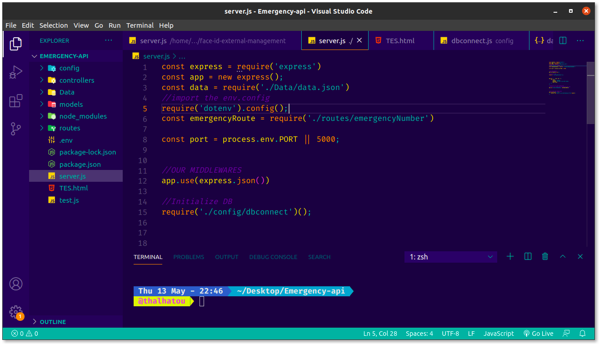
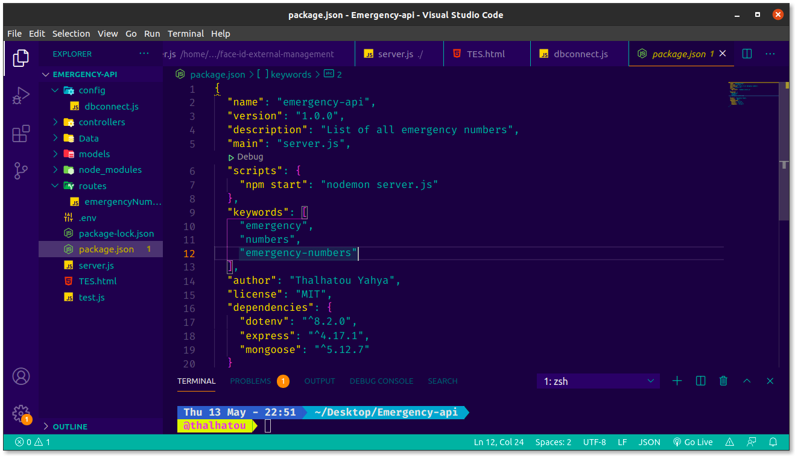
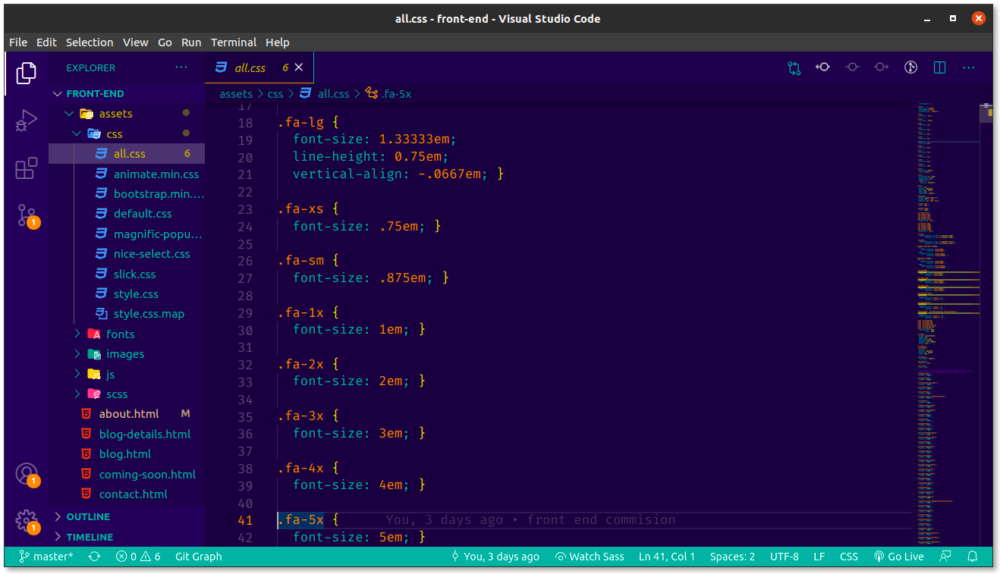

# seven dev Theme for VS Code

Thanks for checking out my VS Code theme 😇. 

A modern Dark Material Theme which lets you stay Seven   while coding.💻

## Color Palette

## Installation

1. Open the extensions sidebar on Visual Studio Code
1. Search for seven dev Theme
1. Click Install
1. Click Reload to reload your editor
1. Enjoy 😇
1. 🌟🌟🌟🌟🌟 Don't forget to Rate Us five-stars 😃

## Issues & Suggestions

For any issues or suggestions, please use [GitHub issues](https://github.com/thalhatou/sevendev-vscode-theme/issues).
